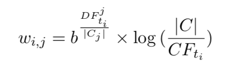

# Class Feature Centroid Classifier
This is a simple machine learning algorithm for text categorization based in the Hu Guan et al. ([available here](http://www2009.eprints.org/21/1/p201.pdf)).



```
$ npm i cfc-classifier
```

### Usage
```
const CFC = require('cfc-classifier')

// Your dataset
const categories = ['a', 'b']
const corpus = [['category A'], ['category B']]

// Create a new classifier instance
const cfc = new CFC(categories, corpus)

// Train the classifier
cfc.train()

// Now you can classify texts
// the function below will return 'a'
cfc.classify('this text will be classified at category A')
```

### Parsing step
In function of remove stopwords, word clustering or things like that this lib is open to insert any parsing steps that you want. In the example below I am inserting a parsing function that only remove the 'a' tokens.

```
const CFC = require('cfc-classifier')

const categories = ['a']
const corpus = [['a simple text, with some! interesting. things']]
const cfc = new CFC(categories, corpus)

// Add a parsing stepthis could be a remove
// stopwords function or something like that
const removeLetterA = (textTokens) => textTokens.filter(token => token.toLowerCase() !== 'a')
cfc.addParsingStep(removeLetterA)

const tokens = cfc.generateTokens(cfc.corpus)

// tokens === [ 'simple', 'text', 'with', 'some', 'interesting', 'things' ]
```

## Testing
You can see examples in the `__tests__` folder.

```
$ npm test
> DEBUG=ava:* nyc ava --color -v

✔ parsingStep › Remove letter A using parsing step
✔ countTermOccurrences › Generate unique terms
✔ tokens › Tokenize documents
✔ classify › Classify a text
✔ uniqueTerms › Generate unique terms

5 tests passed

----------|----------|----------|----------|----------|-------------------|
File      |  % Stmts | % Branch |  % Funcs |  % Lines | Uncovered Line #s |
----------|----------|----------|----------|----------|-------------------|
All files |      100 |      100 |      100 |      100 |                   |
 index.js |      100 |      100 |      100 |      100 |                   |
----------|----------|----------|----------|----------|-------------------|
```